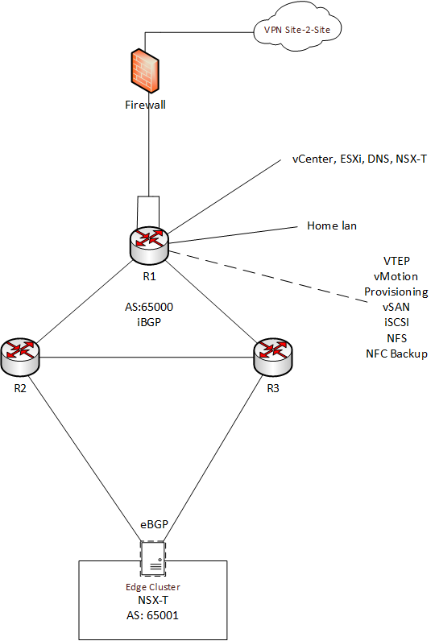

This page has the purpose to share my Home LAB BOM using VMware vSphere stack. vSphere is mainly used for the infrastructure management and hosting, but the environment has also other network components that allow better scalability using Proxmox.
<!--more-->
This home lab was built to test applications, develop automation, test infrastructure components, design/implement network topologies. Besides vSphere it contains other software for backups and Windows and Linux machines.
The following image shows a generic network architecture of this setup. This kind of setup allows flexibility on workload provisioning and redundancy on access to NSX-T workloads:

**Brief description:**

The firewall and R1 represents a Pfsense firewall and a VyOS router that are hosted in a Proxmox hypervisor as two VMs. The R1 has connected several networks, like the home lan subnet, the vSphere management network, and other vSphere related networks.
The R2 and R3 are also two VyOS VMs that form between each other and R1 an iBGP session. R2 and R3 are also connected to Edge nodes and by using an eBGP session, will receive the connected overlay subnets from NSX-T environment. At the same time, those also advertise the other networks to the NSX-T Edge nodes. With this design, redundancy in the access for the NSX-T workloads is achieved.
NSX-T workloads can communicate with the vSphere management network, and accesses are controlled using the NSX-T distributed firewall.
Despites of home lan and management network are connected to the same router, a distinct VRF separates these two domains, and the traffic needs to flow through the firewall, increasing the security.

For backups purpose, a service interface on an isolated T1 gateway is created and connected to a VLAN segment. Veeam components are connected to an overlay segment, that is connected also to this isolated T1. By having this service interface, it will allow the Veeam components to connect to physical servers that still use regular VLANs, like the HP Microserver Gen 8 with Truenas software which host the Veeam backups and provide iSCSI and NFS datastores for the vSphere environment. However, for iSCSI and NFS traffic will not flow through the Edge nodes.  
For providing storage to all the workloads, a 3 node vSAN cluster was configured (FTT=1 RAID 1 storage policy). Are also included services like DRS and HA. Each ESXi has a VMkernel adapter with NFC backup service configured, to be used for backup purposes by Veeam (using NBD protocol).

* First item
* Second item
* Third item
    * First nested item
    * Second nested item

**List of software and hardware used in this setup:**
*Software:*
* ESXi
* vCenter
* vSAN
* NSX-T
* Pfsense
* VyOS
* Proxmox
* Veeam
* Truenas

**Hardware:**
* DELL R620
    * 2x Intel Xeon E5-2680v2
    * 64GB RAM
    * 1x Samsung SSD 850 Evo 500GB + 2x SAS 600GB
    * 4 port Gigabit Ethernet NIC
* DELL R620
    * 2x Intel Xeon E5-2650v2
    * 112GB RAM
    * 1x Samsung SSD 850 Evo 500GB + 2x SAS 600GB
    * 4 port Gigabit Ethernet NIC
* DELL R620
    * 2x Intel Xeon E5-2670
    * 64GB RAM
    * 1x Samsung SSD 850 Evo 500GB + 2x SAS 600GB
    * 4 port Gigabit Ethernet NIC
* Cisco Small Business SG200-26
* Fujitsu Futro S920 ThinClient
    * AMD dual core 2.2Ghz
    * 4GB RAM
* HP Microserver Gen 8 with TrueNAS
    * Intel Xeon E3-1230 V2
    * 16GB RAM
    * 2x SAS 4TB in Mirror
    * 2x SATA 1TB in Mirror
    * SAS controller in **IT Mode**
    * 2 port Gigabit Ethernet NIC

**Average spent: 2000 USD**