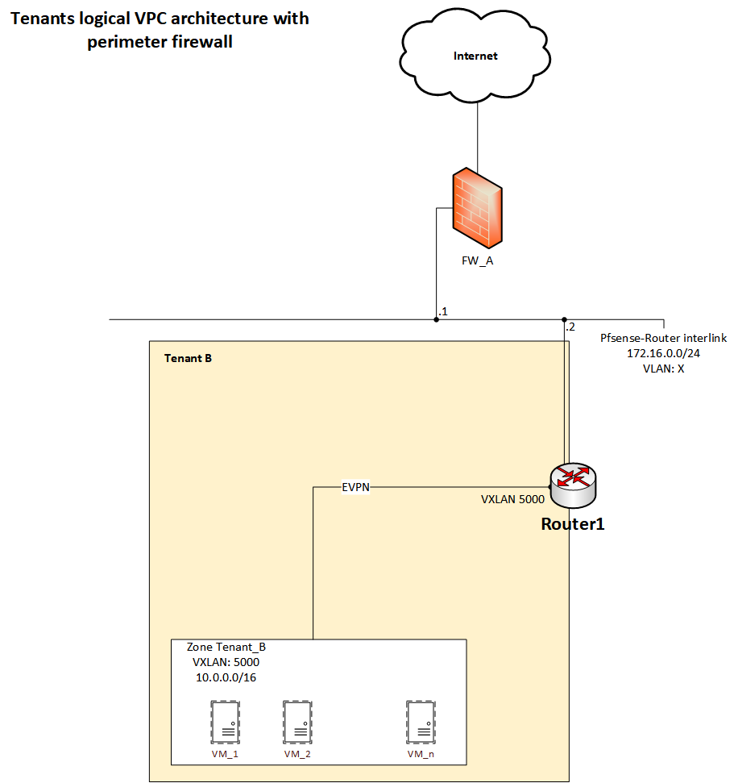
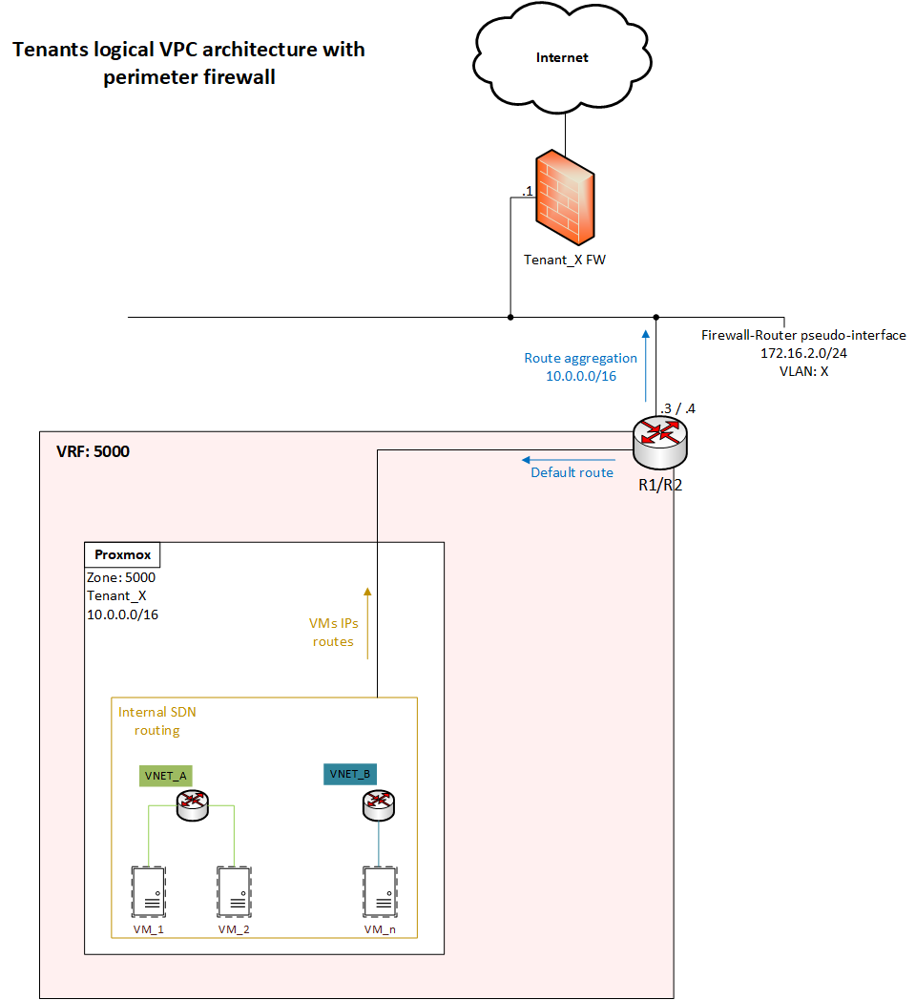

In this part of my Home Lab I use Proxmox and its SDN (Software Defined Network) package. This is also a Home Lab more focused in infrastructure services, and I use it to understand better network, storage and compute (using less powerful resources).
With these two components I can scale more at the network level, beyond the VLANs limitations. The idea is to provide a multi-tenant environment, where duplicated address space can coexist without affecting any of the tenants. 


At this time, I only use local attached storage, supported by a nvme disk. I setup this environment, with the help a VyOS routers (R1 and R2) and a Pfsense as a perimeter firewall for internet access. A description and an image of this setup are below (I will refer R1 and R2 as the routers).






Each tenant has its own address space (by default: 10.0.0.0/16) and is isolated by a Zone (configured in the Proxmox SDN) and a VRF with the same ID on VyOS routers. Tenant VNETs are created based on the Tenant workloads requirements and belongs to only one Zone.
Configuring a Zone, creates internally a VRF in Proxmox server. Since the routers support EVPN, they can act as a peer together with the Proxmox server. In the routers must be configured a VXLAN interface for each tenant with the same ID as the tenant Zone, and a pseudo-interface that will connect to the upstream perimeter firewall.
Pseudo interfaces in VyOS allows "slice" the same physical interface and have configured an IP address and a VLAN ID (which identifies each tenant). Besides this, a default static route via the firewall is configured in both routers and also advertised by BGP to the Tenant VRF in the Proxmox server. With tenant's the dedicated perimeter firewall, north-south firewall rules, IPSec tunnels and NAT for internet access (besides other features) can be configured. The perimeter firewall runs a BGP instance with AS: 64514 and receives a route aggregation of the tenant address space (which avoids receiveing all the VMs IPs routes).

**Below also the VyOS routers issued commands:**
```
    #defines the management VRF and system configurations
    set vrf name management
    set vrf name management table 100
    set interfaces ethernet eth0 vrf management
    #set interfaces ethernet eth0 address x.x.x.x/xx
    set interfaces ethernet eth0 address dhcp # I set this interface for now with DHCP address but should be a static address, like the previous command
    set service ssh vrf management
    set system host-name r1
    set system host-name r2

    #configures the interfaces eth1 with VLAN on the VM NIC, in the same subnet of Proxmox VTEPs
    set interfaces ethernet eth1 address 172.16.0.1/23
    #set interfaces ethernet eth1 address 172.16.0.2/23 #R2
    set interfaces ethernet eth1 description 'proxmox nodes'
    set interfaces ethernet eth1 mtu 1600

    #configures the BGP general settings, adding the Proxmox BGP peer group
    set protocols bgp address-family l2vpn-evpn advertise ipv4 unicast
    set protocols bgp address-family l2vpn-evpn advertise-all-vni
    set protocols bgp system-as 64513
    set protocols bgp neighbor 172.16.0.11 peer-group ibgp
    set protocols bgp neighbor 172.16.0.10 peer-group ibgp
    set protocols bgp neighbor 172.16.0.2 peer-group ibgp
    # set protocols bgp neighbor 172.16.0.1 peer-group ibgp #R2
    set protocols bgp parameters log-neighbor-changes
    set protocols bgp peer-group ibgp address-family l2vpn-evpn
    set protocols bgp peer-group ibgp remote-as 64513
    set protocols bgp peer-group ibgp update-source eth1
    #set the VXLAN interface for TenantA (the VXLAN ID should be the same ID of the VRF-VXLAN from Zone)
    set interfaces vxlan vxlan5000 mtu 1550
    set interfaces vxlan vxlan5000 parameters nolearning
    set interfaces vxlan vxlan5000 port 4789
    set interfaces vxlan vxlan5000 source-address 172.16.0.1
    #set interfaces vxlan vxlan5000 source-address 172.16.0.1 # r2
    set interfaces vxlan vxlan5000 vni 5000
        
    #defines the tenant VRF
    set vrf name tenantA
    set vrf name tenantA protocols bgp address-family ipv4-unicast redistribute connected
    set vrf name tenantA protocols bgp address-family l2vpn-evpn advertise ipv4 unicast
    set vrf name tenantA protocols bgp system-as 64513
    set vrf name tenantA protocols bgp address-family ipv4-unicast redistribute static
    set vrf name tenantA table 5000
    set vrf name tenantA vni 5000
        
    #set the bridge for tenantA
    set interfaces bridge br5000 description tenantA
    set interfaces bridge br5000 member interface vxlan5000
    set interfaces bridge br5000 vrf tenantA

    #set the pseudo interfaces to tenantA tenant with VLAN 3 to access to perimeter firewall
    set interfaces pseudo-ethernet peth2 source-interface eth2
    set interfaces pseudo-ethernet peth2 vif 3
    set interfaces pseudo-ethernet peth2 vif 3 description PseudTenantA
    set interfaces pseudo-ethernet peth2 vif 3 address 172.16.2.3/28
    #set interfaces pseudo-ethernet peth2 vif 3 address 172.16.2.4/28 # r2
    set interfaces pseudo-ethernet peth2 vif 3 vrf tenantA

    #sets the default route, to also be advertised for proxmox servers and firewall
    set vrf name tenantA protocols static route 0.0.0.0/0 next-hop 172.16.2.1

    #defines the firewall as BGP neighbor with AS: 64514
    set vrf name tenantA protocols bgp neighbor 172.16.2.1 remote-as 64514
    set vrf name tenantA protocols bgp neighbor 172.16.2.1 address-family ipv4-unicast

    #defines the route aggregate to be advertised to the firewall
    set vrf name tenantA protocols bgp address-family ipv4-unicast aggregate-address 10.0.0.0/16 summary-only

```

In the PFsense firewall is also required to install FRR package, configure a route-map to not discard the received BGP routes and finally add the BGP neighbors for R1 and R2.

In the second part of this Homelab, I added a Truenas storage system that is able to provide Storage as service to the tenants.