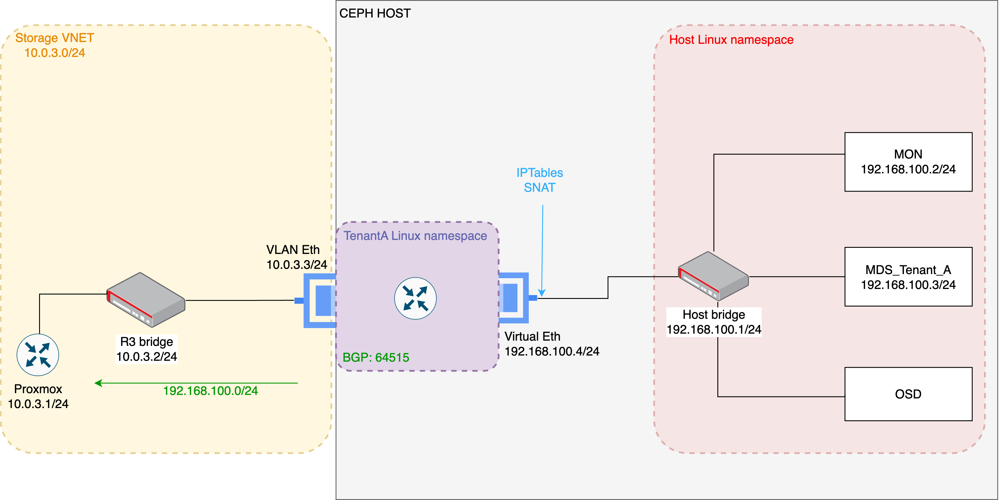

Welcome to the third part of my Proxmox Homelab. In this post I figured out a possible solution for the NFS problem described in: [Part2](/homelab/proxmox-part2) . The previous mentioned issue can be fixed by performing SNAT on the VyOS router (on the tenant interface that connects point-to-point to the Truenas storage) and limiting the access on the NFS shares to only this interface IP address. However, I approached this problem using a different technology: Ceph. 
<!--more-->

Briefly under the hood, Ceph has several daemons/processes like:
* MON -mainly used for client’s authentication
* MDS - used as a metadata daemon for Ceph file
* OSD - the daemon that is responsible for processing the data IO

If we check the Ceph architecture, Ceph uses a **public network** that should be exposed to the clients to enable them accessing to storage services. For every daemon is possible to configure this parameter, as also another parameter: **public address**, which the address that the daemon will bind.

This post describes my approach to allow tenants use Ceph FS (file storage services), but implementing Ceph is not straight forward in a multitenant environment. Ceph FS creates a MDS daemon responsible for handling some metadata commands that are made on the share by the clients.

The public network is a shared network and Ceph daemons bind to the first network interface that as an IP belonging to the specified public network (at least from my experiments this was the behavior) that can be configured. But configuring for example the public network and public address to use the tenant /30 subnet creates a big issue because only the tenant that can access through this /30 subnet will be able to perform I/O on the storage. The OSD daemon should be exposed in a shared network, but since my setup includes duplicated address spaces, the problem in identifying uniquely each tenant still exists.

I concluded that without performing SNAT I cannot identify easily each Ceph client. With this I decided to dig a little deep into Linux network namespaces and try to perform SNAT on the Ceph host.
The idea of using Linux network namespaces is to expose the Ceph public network in a different way, because within this namespace routing and NAT is also possible. The following image shows the architecture of this setup:



In the Ceph host Linux namespace a bridge is created as also several virtual interfaces. These virtual interfaces will connect to the bridge and will have configured IP addresses on the subnet 192.168.100.0/24 (for now I just used a typical small subnet) that will be used to bind the MON, OSD and MDS daemons. 

Each tenant will have its own Linux network namespace, containing two interfaces:

1.	a VLAN interface (associated with a physical NIC) configured with an IP address belonging to the tenant storage Proxmox VNET. With a bridge in the VyOS router I can extend this storage VNET to the Ceph host, allowing only that routing happens in the Proxmox nodes and Ceph. As a requirement, a dedicated VNET in Proxmox must be created.
2.	A virtual interface configured with an IP on the Ceph public network (192.168.100.0/24) that will perform SNAT on the traffic coming from the tenant’s workloads. In this way I can identify uniquely each tenant and workload.

To increase security, an IP tables rule is set by allowing only the access to the MDS daemon from the virtual interface on the tenant Linux network namespace. With this firewall rule even if the tenant credentials are leaked will not be possible to perform any operation (no even mount) the tenant share by any other tenants. As recommended, credentials rotation for the access to shares is always advisable (but not described in this post).

Additionally, a BGP process is instantiated in the tenant Linux network namespace, to allow Ceph public network to be advertised to the Proxmox servers. The BGP neighbor is the IP address defined on the bridge that extends the Storage VNET. The pseudo interface on VyOS router was replaced by a "normal" VLAN interface (at the time I wrote the other post, I understood wrongly that the pseudo interface and VLAN interface are the same) because pseudo interfaces have several limitations when compared to VLAN interfaces, like for example not being able to learn MAC addresses when "working inside" of bridges. Setting an IP address on the VyOS bridge is a requirement to allow this BGP connection to be established. 

**Note: This setup results in an additional load for processing this routing and the NAT translation.**

Below the commands used to configure VyOS router and the Ceph node:
**Ceph host**
```bash
enable routing on the host
sudo sysctl -w net.ipv4.ip_forward=1

#HOST namespace bridge
sudo ip link add name br0 type bridge
sudo ip link set br0 up
sudo ip addr add 192.168.100.1/24 dev br0

#HOST namespace configuration for the ceph MON interface
sudo ip link add veth-mon type veth peer name veth-mon-br
sudo ip addr add 192.168.100.2/24 dev veth-mon
sudo ip link set veth-mon-br up
sudo ip link set veth-mon up

#HOST namespace configuration for the ceph tenantA MDS interface
sudo ip link add veth-mds-a type veth peer name veth-mds-a-br  
sudo ip addr add 192.168.100.3/24 dev veth-mds-a
sudo ip link set veth-mds-a-br up
sudo ip link set veth-mds-a up

#Namespace tenantA
sudo ip netns add tenantA

#set physical interface ns tenantA
sudo ip link set enp6s19 netns tenantA
sudo ip netns exec tenantA ip addr add 10.0.3.3/24 dev enp6s19
sudo ip netns exec tenantA ip link set enp6s19 up

#set the tenantA ns virtual interface to connect to bridge
sudo ip link add veth1-ta type veth peer name veth1-ta-br
sudo ip link set veth1-ta netns tenantA
sudo ip netns exec tenantA ip addr add 192.168.100.4/24 dev veth1-ta
sudo ip netns exec tenantA ip link set veth1-ta up
sudo ip link set veth1-ta-br master br0
sudo ip link set veth1-ta-br up


#add the tenantA address space to the tenantA namespace
sudo ip netns exec tenantA ip route add 10.0.0.0/16 via 10.0.3.1 dev enp6s19
sudo ip netns exec tenantA sysctl -w net.ipv4.ip_forward=1


#Configure SNAT on interface veth1-ta of tenantA namespace
sudo ip netns exec tenantA iptables -t nat -A POSTROUTING -s 10.0.0.0/16 -o veth1-ta -j SNAT --to-source 192.168.100.4

#add the iptables rules
iptables -A INPUT -s 192.168.100.4 -d 192.168.100.3 -j ACCEPT
iptables -A INPUT -m state --state RELATED,ESTABLISHED -j ACCEPT
iptables -A INPUT -d 192.168.100.3 -j DROP
```

**VyOS Router R3**
```bash
#deletes interfaces and removes the R1 and R2 neighbors
delete interfaces pseudo-ethernet peth2 vif 3 address 172.16.3.1/30
delete interfaces pseudo-ethernet peth2 vif 3 vrf tenantA
delete interfaces vxlan vxlan5000 parameters 
delete interfaces pseudo-ethernet peth2 vif 3
delete protocols bgp neighbor 172.16.0.1
delete protocols bgp neighbor 172.16.0.2

#configure the Proxmox neighbors
set protocols bgp neighbor 172.16.0.10 address-family l2vpn-evpn
set protocols bgp neighbor 172.16.0.10 remote-as 64513
set protocols bgp neighbor 172.16.0.10 update-source eth1
set protocols bgp neighbor 172.16.0.11 address-family l2vpn-evpn
set protocols bgp neighbor 172.16.0.11 remote-as 64513
set protocols bgp neighbor 172.16.0.11 update-source eth1

set interfaces vxlan vxlan5007 mtu 1550
set interfaces vxlan vxlan5007 port 4789
set interfaces vxlan vxlan5007 source-address 172.16.0.3
set interfaces vxlan vxlan5007 vni 5007
set interfaces bridge br5000 member interface vxlan5007
set interfaces vxlan vxlan5007 vlan-to-vni 3 vni '5007'

set interfaces ethernet eth2 vif 3 description StorageTenantA
set interfaces bridge br5000 member interface eth2.3

#ceph as BGP neighbor
set interfaces bridge br5000 address 10.0.3.2/24 #set an interface in the tenant Zone bridge
set vrf name tenantA protocols bgp neighbor 10.0.3.3 remote-as 64515
set vrf name tenantA protocols bgp neighbor 10.0.3.3 address-family ipv4-unicast
```

**To configure BGP in the tenant namespace, the following commands are required:**
```bash
sudo apt update && sudo apt install frr -y
sudo systemctl stop frr
sudo systemctl disable frr
# In the frr main folder, in the "daemons" file, we need to change bgpd=no to bgpd=yes. This will allow the bgpd running in the every namespace
mkdir /etc/frr/tenantA
cd /etc/frr
cp daemons tenantA/
cp frr.conf tenantA/
# edit the daemons file
# change the bgpd=yes
# change the bgpd and zebra listening processes to:
# zebra_options="  -A 10.0.3.3 -s 90000000"
# bgpd_options="   -A 10.0.3.3"

# Add the following lines to frr.conf in tenantA frr dir
log syslog informational
log file /var/log/frr/teanantA.log debugging
!
route-map ALLOW_ALL permit 10
exit
!
router bgp 64515
 bgp router-id 10.0.3.3
 neighbor 10.0.3.2 remote-as 64513
 network 192.168.100.0/24
 neighbor 10.0.3.2 route-map ALLOW_ALL in
 neighbor 10.0.3.2 route-map ALLOW_ALL out
 exit

#restart/start the BGP process in tenant namespace
sudo ip netns exec tenantA /usr/lib/frr/frrinit.sh restart tenantA
```

**To install Ceph in a single node with 3 disks**
```bash
#install ceph
apt remove -y prometheus-node-exporter
apt install -y cephadm
apt install -y ceph-common

cephadm bootstrap --mon-ip 192.168.100.2 --single-host-defaults --log-to-file --cluster-network "192.168.178.0/24"

## after installation, services started, CephFS share created, OSD pool created, client created:
#set the osd network
ceph config set osd public_network "192.168.100.0/24"

#restart the osd dameons
ceph orch restart osd.cost_capacity

ceph config set mds.tenanta public_addr "192.168.100.3"
ceph config set mds.tenanta public_network "192.168.100.0/24"
ceph orch restart mds.tenanta


ceph config set mds.tenantc public_addr "192.168.100.5"
ceph config set mds.tenantc public_network "192.168.100.0/24"
ceph orch restart mds.tenantc
```
