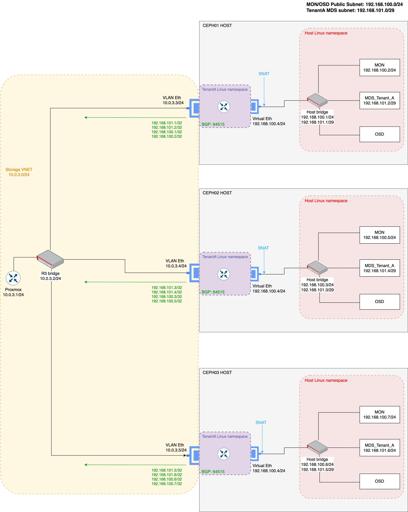

Welcome to the fourth post about my *Proxmox homelab: Improving Ceph setup redundancy* regarding the storage service. In the previous two posts, my goal was adding a storage service that can be consumed by the tenants. Didn’t work well using NFS with TrueNas, but using Ceph I achieved it. Let’s see how I was able to improve the redundancy of the Ceph setup, at the same time maintaining a multi tenant architecture.
<!--more-->

If you didn’t read the 3 previous posts, below is a short summary about them for your awareness: 

1. [Part1](/homelab/proxmox) - Enabling multitenancy – setup an environment that can host multiple tenants completely isolated and using duplicated address space.
2. [Part2](/homelab/proxmox-part2) - Adding a NFS storage solution with Truenas – tenants might need to consume storage, and the idea was to provide it by NFS. However, I faced a high security concern caused by the "nature of NFS".
3. [Part3](/homelab/proxmox-part3) - Solving the NFS problem using Ceph – implement a multitenant storage service solution using one Ceph node.  With the help of **Linux Namespaces** and customizing the ceph public network I managed to have one ceph node that provides CephFS, while I can isolate every workload uniquely.


Now that I was able to setup one Ceph host to provide CephFS to the tenant workloads, is time to increase its redundancy. For this setup I used 3 machines as also Linux namespaces and bridges. The architecture of this setup is below:



The architecture does not show many differences in the configuration for the Ceph nodes when compared with the architecture in post number 3, but those are important for the overall of the setup. After understanding a bit how Ceph can work in a multitenant environment (which does not come by design of Ceph), and after also understand that SNAT is the way to identify uniquely each workload, I also understood that MON and OSD daemons need to be hosted in a shared subnet (defined in public network) that needs to be accessed by all the tenants. However, the same does not applies to the MDS daemon. This means we can set a different subnet (defining its own public network), that can be different for every tenant (remember that MDS daemon is a process that allows run metadata commands on the CephFS like: cd, ls…). As all the other daemons, the MDS will bind to the first interface that is available on its defined public network.


The idea of having a MDS subnet for each tenant is to create a network isolation among the tenants. By being different for each tenant, is not required to set **IPtables** rules because the tenants will not be able to reach the other tenant MDS, since the /32 IPs advertised by BGP only include the tenant /29 subnet IPs. With multiple IPs on the bridge of the Host Linux network namespace, is possible to route between the different networks of MON, OSD and the dedicated tenant MDS. Another /32 IPs that need also to be advertised by BGP are the IPs initially defined on the public network of MON and OSD daemons. These IPs need individually to be advertised because these processes (MON and OSD) bind also to an IP on the defined public network, and clients must reach directly them to authenticate and perform IO respectively.


Going back to the MDS daemon, this process can be isolated from every tenant and using a /29 subnet we have 6 IPs available to handle MDS active and passive daemons, and to be set on the bridges to perform routing (in the list of commands for the Ceph installation there's one to create an additional MDS passive daemon). Also, another requirement, is the MDS active and passive daemons needs to communicate between each other and between the MON, meaning different IPs needs to be configured on each Ceph host. The configuration to advertise the /32 IPs instead of the /29 network, is due the fact that Ceph has its own failover mechanism and the Ceph client will forward the requests to the correct MDS daemon in case of failure. This means that advertising the /29 subnet will create issues because with BGP is not possible to understand what MDS is active and what's its associated IP address. The same applies to the IPs on the MON and OSD public subnet.


The architecture doesn’t show the Ceph cluster network, but this is a different subnet with a dedicated physical interface. Also, is not shown another physical interface on the Host Linux namespace that belongs to each Ceph host bridge, but from the issued commands you can identify it easily.

Below are the commands that I issued on the 3 Ceph hosts, the BGP configuration in each Ceph node and the router R3 and finally the commands to simply install Ceph and configure a CephFS to one tenant. Please be aware that for Ceph installation and configuration, several steps are missing (like creating the client and setting the permissions, creating the cluster, create the CephFS share).


**Ceph01**
```bash
#Host namespace
#enable routing on the host
sudo sysctl -w net.ipv4.ip_forward=1

# HOST namespace bridge creation
sudo ip link add name br0 type bridge
sudo ip link set br0 up
ip link set enp6s19 master br0
sudo ip addr add 192.168.100.1/24 dev br0
sudo ip addr add 192.168.101.1/29 dev br0

# HOST namespace configuration for the ceph MON interface
sudo ip link add veth-mon type veth peer name veth-mon-br
sudo ip addr add 192.168.100.2/24 dev veth-mon
sudo ip link set veth-mon-br up
sudo ip link set veth-mon up

# HOST namespace configuration for the ceph tenantA MDS interface
sudo ip link add veth-mds-a type veth peer name veth-mds-a-br  
sudo ip addr add 192.168.101.2/29 dev veth-mds-a
sudo ip link set veth-mds-a-br up
sudo ip link set veth-mds-a up

# Create linux namespace tenantA
sudo ip netns add tenantA

# set physical interface ns tenantA
sudo ip link set enp6s20 netns tenantA
sudo ip netns exec tenantA ip addr add 10.0.3.3/24 dev enp6s20
sudo ip netns exec tenantA ip link set enp6s20 up

# set the tenantA ns virtual interface to connect to bridge
sudo ip link add veth1-ta type veth peer name veth1-ta-br
sudo ip link set veth1-ta netns tenantA
sudo ip netns exec tenantA ip addr add 192.168.100.4/24 dev veth1-ta
sudo ip netns exec tenantA ip link set veth1-ta up
sudo ip link set veth1-ta-br master br0
sudo ip link set veth1-ta-br up

# add the tenantA address space route to the tenantA namespace
sudo ip netns exec tenantA ip route add 10.0.0.0/16 via 10.0.3.1 dev enp6s20
sudo ip netns exec tenantA sysctl -w net.ipv4.ip_forward=1

# add the MDS /32 IPs routes to be advertised by BGP
sudo ip netns exec tenantA ip route add 192.168.101.1/32 via 192.168.100.4 dev veth1-ta
sudo ip netns exec tenantA ip route add 192.168.101.2/32 via 192.168.100.4 dev veth1-ta
ip netns exec tenantA ip route add 192.168.100.1/32 via 192.168.100.4 dev veth1-ta
ip netns exec tenantA ip route add 192.168.100.2/32 via 192.168.100.4 dev veth1-ta

# Configure SNAT on interface veth1-ta of tenantA namespace
sudo ip netns exec tenantA iptables -t nat -A POSTROUTING -s 10.0.0.0/16 -o veth1-ta -j SNAT --to-source 192.168.100.4
```

**Ceph02**
```bash
# Host namespace
#enable routing on the host
sudo sysctl -w net.ipv4.ip_forward=1

# HOST namespace bridge creation
sudo ip link add name br0 type bridge
sudo ip link set br0 up
ip link set enp6s19 master br0
sudo ip addr add 192.168.100.3/24 dev br0
sudo ip addr add 192.168.101.3/29 dev br0

# HOST namespace configuration for the ceph MON interface
sudo ip link add veth-mon type veth peer name veth-mon-br
sudo ip addr add 192.168.100.5/24 dev veth-mon
sudo ip link set veth-mon-br up
sudo ip link set veth-mon up

# HOST namespace configuration for the ceph tenantA MDS interface
sudo ip link add veth-mds-a type veth peer name veth-mds-a-br  
sudo ip addr add 192.168.101.4/29 dev veth-mds-a
sudo ip link set veth-mds-a-br up
sudo ip link set veth-mds-a up

# Create linux namespace tenantA
sudo ip netns add tenantA

# set physical interface ns tenantA
sudo ip link set enp6s20 netns tenantA
sudo ip netns exec tenantA ip addr add 10.0.3.4/24 dev enp6s20
sudo ip netns exec tenantA ip link set enp6s20 up

# set the tenantA ns virtual interface to connect to bridge
sudo ip link add veth1-ta type veth peer name veth1-ta-br
sudo ip link set veth1-ta netns tenantA
sudo ip netns exec tenantA ip addr add 192.168.100.4/24 dev veth1-ta
sudo ip netns exec tenantA ip link set veth1-ta up
sudo ip link set veth1-ta-br master br0
sudo ip link set veth1-ta-br up

# add the tenantA address space to the tenantA namespace
sudo ip netns exec tenantA ip route add 10.0.0.0/16 via 10.0.3.1 dev enp6s20
sudo ip netns exec tenantA sysctl -w net.ipv4.ip_forward=1

# add the MDS /32 IPs routes to be advertised by BGP
sudo ip netns exec tenantA ip route add 192.168.101.3/32 via 192.168.100.4 dev veth1-ta
sudo ip netns exec tenantA ip route add 192.168.101.4/32 via 192.168.100.4 dev veth1-ta
ip netns exec tenantA ip route add 192.168.100.3/32 via 192.168.100.4 dev veth1-ta
ip netns exec tenantA ip route add 192.168.100.5/32 via 192.168.100.4 dev veth1-ta

# Configure SNAT on interface veth1-ta of tenantA namespace
sudo ip netns exec tenantA iptables -t nat -A POSTROUTING -s 10.0.0.0/16 -o veth1-ta -j SNAT --to-source 192.168.100.4
```

**Ceph03**
```bash
#Host namespace
#enable routing on the host
sudo sysctl -w net.ipv4.ip_forward=1

# HOST namespace bridge creation
sudo ip link add name br0 type bridge
sudo ip link set br0 up
ip link set enp6s19 master br0
sudo ip addr add 192.168.100.6/24 dev br0
sudo ip addr add 192.168.101.5/29 dev br0

# HOST namespace configuration for the ceph MON interface
sudo ip link add veth-mon type veth peer name veth-mon-br
sudo ip addr add 192.168.100.7/24 dev veth-mon
sudo ip link set veth-mon-br up
sudo ip link set veth-mon up

# HOST namespace configuration for the ceph tenantA MDS interface
sudo ip link add veth-mds-a type veth peer name veth-mds-a-br  
sudo ip addr add 192.168.101.6/29 dev veth-mds-a
sudo ip link set veth-mds-a-br up
sudo ip link set veth-mds-a up

# Create linux namespace tenantA
sudo ip netns add tenantA

# set physical interface ns tenantA
sudo ip link set enp6s20 netns tenantA
sudo ip netns exec tenantA ip addr add 10.0.3.5/24 dev enp6s20
sudo ip netns exec tenantA ip link set enp6s20 up

# set the tenantA ns virtual interface to connect to bridge
sudo ip link add veth1-ta type veth peer name veth1-ta-br
sudo ip link set veth1-ta netns tenantA
sudo ip netns exec tenantA ip addr add 192.168.100.4/24 dev veth1-ta
sudo ip netns exec tenantA ip link set veth1-ta up
sudo ip link set veth1-ta-br master br0
sudo ip link set veth1-ta-br up

# add the tenantA address space to the tenantA namespace
sudo ip netns exec tenantA ip route add 10.0.0.0/16 via 10.0.3.1 dev enp6s20
sudo ip netns exec tenantA sysctl -w net.ipv4.ip_forward=1

# add the MDS /32 IPs routes to be advertised by BGP
sudo ip netns exec tenantA ip route add 192.168.101.5/32 via 192.168.100.4 dev veth1-ta
sudo ip netns exec tenantA ip route add 192.168.101.6/32 via 192.168.100.4 dev veth1-ta
ip netns exec tenantA ip route add 192.168.100.6/32 via 192.168.100.4 dev veth1-ta
ip netns exec tenantA ip route add 192.168.100.7/32 via 192.168.100.4 dev veth1-ta

# Configure SNAT on interface veth1-ta of tenantA namespace
sudo ip netns exec tenantA iptables -t nat -A POSTROUTING -s 10.0.0.0/16 -o veth1-ta -j SNAT --to-source 192.168.100.4
```

**R3 BGP configuration, adding as neighbors the two additional Ceph nodes**
```bash
set vrf name tenantA protocols bgp neighbor 10.0.3.4 remote-as 64515
set vrf name tenantA protocols bgp neighbor 10.0.3.4 address-family ipv4-unicast

set vrf name tenantA protocols bgp neighbor 10.0.3.5 remote-as 64515
set vrf name tenantA protocols bgp neighbor 10.0.3.5 address-family ipv4-unicast
```

**BGP configuration in each Ceph host (using FRR)**

For the BGP setup on each Ceph host, is also possible to run FRR in each tenant Linux namespace. 
1. Create a subfolder for each tenant in */etc/frr* location
2. Copy the *frr.conf* and *daemons* files in */etc/frr* to the previous created subfolder
3. Enable the BGP daemon in *daemons* file: *bgpd=yes*
4. Copying the respective Ceph node frr configuration to *frr.conf*
5. Run the below command to start a BGP instance on the tenant Linux namespace: 
```bash 
sudo ip netns exec tenantA /usr/lib/frr/frrinit.sh restart tenantA 
```

**Ceph01**
```bash
log syslog informational
log file /var/log/frr/teanantA.log debugging
!
route-map ALLOW_ALL permit 10
exit
!
router bgp 64515
 bgp router-id 10.0.3.3
 neighbor 10.0.3.2 remote-as 64513
 network 192.168.100.1/32
 network 192.168.100.2/32
 network 192.168.101.1/32
 network 192.168.101.2/32
 neighbor 10.0.3.2 route-map ALLOW_ALL in
 neighbor 10.0.3.2 route-map ALLOW_ALL out
 exit
 ```
 **Ceph02**
 ```bash
log syslog informational
log file /var/log/frr/teanantA.log debugging
!
route-map ALLOW_ALL permit 10
exit
!
router bgp 64515
 bgp router-id 10.0.3.3
 neighbor 10.0.3.2 remote-as 64513
 network 192.168.100.3/32
 network 192.168.100.5/32
 network 192.168.101.3/32
 network 192.168.101.4/32
 neighbor 10.0.3.2 route-map ALLOW_ALL in
 neighbor 10.0.3.2 route-map ALLOW_ALL out
 exit
 ```

**Ceph03**
```bash
log syslog informational
log file /var/log/frr/teanantA.log debugging
!
route-map ALLOW_ALL permit 10
exit
!
router bgp 64515
 bgp router-id 10.0.3.3
 neighbor 10.0.3.2 remote-as 64513
 network 192.168.100.6/32
 network 192.168.100.7/32
 network 192.168.101.5/32
 network 192.168.101.6/32
 neighbor 10.0.3.2 route-map ALLOW_ALL in
 neighbor 10.0.3.2 route-map ALLOW_ALL out
 exit
```

**Ceph01 installation (main node)**
```bash
apt install -y cephadm
apt install -y ceph-common
cephadm bootstrap --mon-ip 192.168.100.2 --log-to-file --cluster-network "192.168.178.0/24" --ssh-user MACHINE_USER

# Copy the /etc/ceph/ceph.pub to all other nodes
# Install docker engine in all the other nodes
# In the user MACHINE_USER, in ssh_authorized_keys file add the previous pub key
# Expand the cluster using the dashboard and create an OSD pool

# After creating the tenant Filesystem, issue the following commands:
# The two below will set the correct MDS public network
ceph config set mds.tenanta public_network "192.168.101.0/29"
ceph orch restart mds.tenanta

# Next two will set the OSD public network, and restart he OSD pool that was previously created
ceph config set osd public_network "192.168.100.0/24"
ceph orch restart osd.dashboard-admin-1743540453756 # the osd name could be different from setup to setup, adjust accordingly to yours

# With the following command an additional standby MDS is created on the FS.
ceph orch apply mds tenanta --placement=2
```