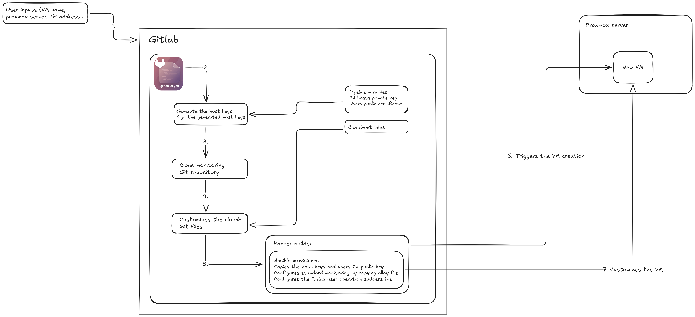
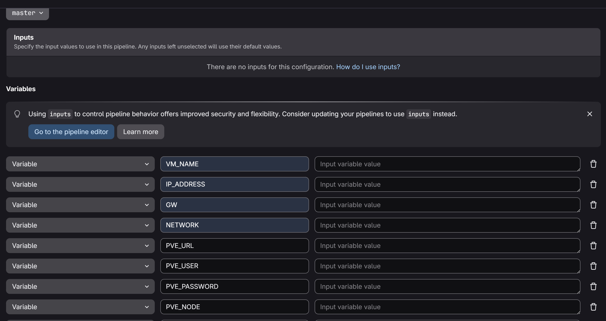

After the previous post about Packer and OpenSuse, I decided to change my process of creating VMs in my homelab. I use the CLI in the Proxmox server to clone a template that is cloud-init prepared (applying then a custom cloud-init file). Although is quite automated, still not enough. So, why not use Packer and a Gitlab pipeline? As you will see, this improvement also gave me a simple frontend to provision VMs simply with custom parameters like VM name, network and hostname..
<!--more-->


As already mentioned, to create new VMs I use normally custom cloud-init files (user-data and network) and then issue CLI commands in 
the Proxmox server to clone a template that is cloud-init prepared. This set a new VM with the required hostname, users, NTP 
and network configuration, as also installs the required packages that define on my "standard baseline". 


But remember, from the previous post, that Packer can also be used to set this VM "standard baseline"? So, I created a Gitlab CI/CD pipeline that runs Packer to provision a new VM using the Proxmox clone module and customizing it. At the end, the Packer module converts this new VM to a template. The pipeline architecture is shown in the below picture:



For more detail about all these steps:
-	Creates new SSH host keys
-	Clones the template and uses cloud-init file to set users, install packages and configure NTP and network
-	Sets a simple monitoring configuration using Grafana Alloy, allowing the new VM to send the metrics and logs to a centralized monitoring platform (Mimir and Loki)
-	Uploads the “users public SSH CA” to the new VM (will explain later)
-	Sets a day-2 operations user for the routine operations. This is the only user that can access via SSH private key, and is only able to login from the machine that hosts [SemaphoreUI](https://semaphoreui.com/). Be aware that this user private key is used in Packer and is not present in the Git repository.

Example of triggering manually a pipeline:


So, what is the "users public SSH CA"? I decided also to follow a new way for the access to the VMs and the main goal was shifting from SSH keys to SSH certificates, including also checking the SSH host keys. With this way I don't need to copy any SSH public key for any VM, since the SSH certificates are used for authentication. More details: [SSH Certificates](https://goteleport.com/blog/how-to-configure-ssh-certificate-based-authentication/)

The following commands show you how to create the "users and hosts CA" and a user SSH certificate :

```bash
#Creates the user CA
ssh-keygen -t ed25519 -f ssh_user_ca -C "SSH User CA"
#Creates the hosts CA
ssh-keygen -t ed25519 -f ssh_host_ca -C "SSH Host CA"
#Creates the user key pair "username"
ssh-keygen -t ed25519 -f username
#Generates the certificate for the user
ssh-keygen -s ssh_user_ca -I username_cert  -n username  -V +365d  username.pub
```

A few notes about the arguments of the previous command:
```bash
-s ssh_user_ca → the user CA  private key
-n username → principal (user allowed in the system). Be aware this user is present locally in the VM
-V +365d → expire date
```

The last step of this, is adding the line in the file known_hosts in /home/user/.ssh/ dir, on the client machine:
```bash
@cert-authority * ssh-ed25519 AAAAC3NzaC1lZDI1NTE5AAAAIAZr7R6LMSzmlVGF0HgB6fRsel4s6HrnrjpkRzXYtBqb SSH Host CA
```
At bold is the public "part" of the hosts CA, and when accessing the VMs you will noticing there will be no warning message regarding unknown host keys.

You can access via SSH to the new VMs by:
```bash
ssh -v -i user_private_key   -o CertificateFile=user_cert.pub     username@fqnd_of_the_server
```

I finish this post with the Git repository link with the all the files: [Gitlab pipeline for Proxmox](https://github.com/lptekdev/gitlab-proxmox-packer)